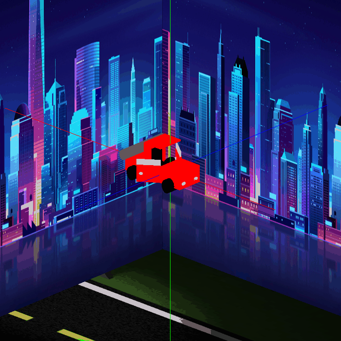

# OpenGLScene
A scene made using GLUT in C++
The project is based on triangles mesh which are used for creating geometries such as cube, sphere, cylinder, etc.
The car and the scenario only uses these figures.

# View of the car

# Run the proyect
Download the files and use make in the directory.
  **1)** make 
